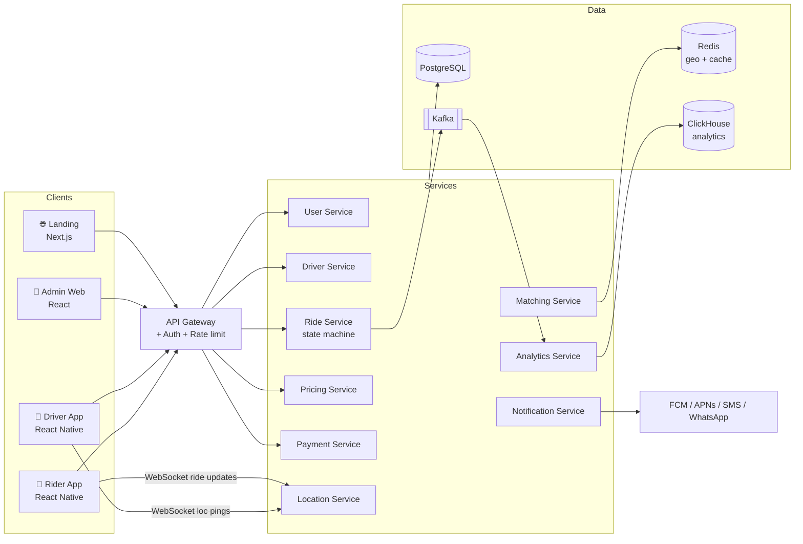

# 🏗️ RYDR — System Architecture

Target architecture for building RYDR beyond the HTML prototypes.

## 1. High-level diagram



## 2. Tech stack

| Layer | Choice | Why |
|-------|--------|-----|
| Mobile apps | React Native (or Flutter) | One codebase, native maps modules |
| Admin | React + Vite + Tailwind | Fast iteration |
| Landing | Next.js | SEO, city pages |
| API | Node.js (NestJS) or Go | WebSocket-heavy workloads |
| Primary DB | PostgreSQL + PostGIS | Relational + geo queries |
| Realtime/geo | Redis (GEO commands, pub/sub) | Sub-ms nearest-driver lookups |
| Events | Kafka | Ride events, analytics, audit |
| Analytics | ClickHouse + Metabase | Cheap OLAP at scale |
| Maps | Google Maps Platform / Mapbox / OSRM | Geocode, route, ETA |
| Payments | Razorpay (IN) / Stripe | UPI + cards + wallets |
| Notifications | FCM, APNs, Twilio (SMS/WhatsApp/masking) | |
| Infra | Docker + Kubernetes, Terraform | Multi-city scale |

## 3. Core data model (simplified)

```sql
users(id, phone, name, email, photo_url, rating, wallet_balance, status, created_at)
drivers(id, user_id, license_no, kyc_status, vehicle_id, rating, acceptance_rate,
        is_online, current_lat, current_lng, last_ping_at)
vehicles(id, driver_id, category, make, model, plate, color, year, ev boolean)
rides(id, rider_id, driver_id, category, status,           -- state machine below
      pickup_lat, pickup_lng, pickup_addr, drop_lat, drop_lng, drop_addr,
      otp, distance_m, duration_s, route_polyline,
      fare_estimate, fare_final, surge_multiplier,
      requested_at, accepted_at, started_at, completed_at, cancelled_at, cancel_reason)
payments(id, ride_id, method, amount, status, gateway_ref, created_at)
wallet_ledger(id, user_id, ride_id, type debit|credit, amount, balance_after, note)
promos(id, code, type flat|percent, value, max_discount, usage_cap, per_user_cap, expires_at)
ratings(id, ride_id, by_role, stars, tags[], comment)
zones(id, city_id, name, polygon, surge_multiplier, updated_at)
sos_events(id, ride_id, raised_by, lat, lng, status, resolved_by, created_at)
```

## 4. Ride state machine

```
REQUESTED → SEARCHING → DRIVER_ASSIGNED → DRIVER_ARRIVED
   → ONGOING (OTP verified) → COMPLETED → PAID
Any pre-ONGOING state → CANCELLED_BY_RIDER | CANCELLED_BY_DRIVER | EXPIRED
```

Rules:
- `SEARCHING` fans out to nearest N online drivers in expanding radius (Redis GEO),
  15s acceptance window each, max 3 waves before `EXPIRED`.
- OTP shown to rider, entered by driver → transitions to `ONGOING`.
- Cancellation fee applies > 3 min after `DRIVER_ASSIGNED`.

## 5. Matching algorithm (v1)

1. Rider requests → compute pickup H3 cell (res 8).
2. `GEORADIUS` on Redis for online, idle drivers of that category within 3 km.
3. Rank by: ETA to pickup (primary), rating, acceptance rate.
4. Offer to top driver, 15s timer → next driver on decline/timeout.
5. No driver in 3 waves → expand radius to 6 km → else fail gracefully with retry CTA.

## 6. Pricing

```
fare = base[category] + per_km * dist + per_min * duration
fare = fare * surge(zone)          -- capped at admin-configured max (e.g. 2.5x)
fare = max(fare, min_fare[category]) + tolls + taxes - promo
```

Surge per zone = f(open requests / idle drivers), recomputed every 60s, admin-overridable.

## 7. Security & privacy

- JWT access (15 min) + refresh tokens; OTP login rate-limited.
- Number masking on rider↔driver calls (Twilio Proxy).
- PII encrypted at rest; payment data never touches our servers (gateway tokenization).
- RBAC for admin (super/ops/support/finance) + immutable audit log.
- Location retention policy: raw pings 30 days, aggregated forever.

## 8. APIs (sample)

```
POST /auth/otp/request            {phone}
POST /auth/otp/verify             {phone, otp} → tokens
GET  /fares/estimate?from&to      → per-category fares + ETAs
POST /rides                       {from, to, category, payment_method}
GET  /rides/:id                   → status, driver, live position
POST /rides/:id/cancel            {reason}
POST /rides/:id/rate              {stars, tags, comment}
WS   /realtime                    ride status + driver location stream
-- driver
POST /driver/status               {online: bool}
POST /driver/rides/:id/accept | /decline | /start {otp} | /complete
GET  /driver/earnings?range=today|week|month
-- admin
GET  /admin/metrics/overview
GET  /admin/rides?status=&city=
POST /admin/drivers/:id/kyc      {approve|reject, reason}
POST /admin/zones/:id/surge      {multiplier}
```
